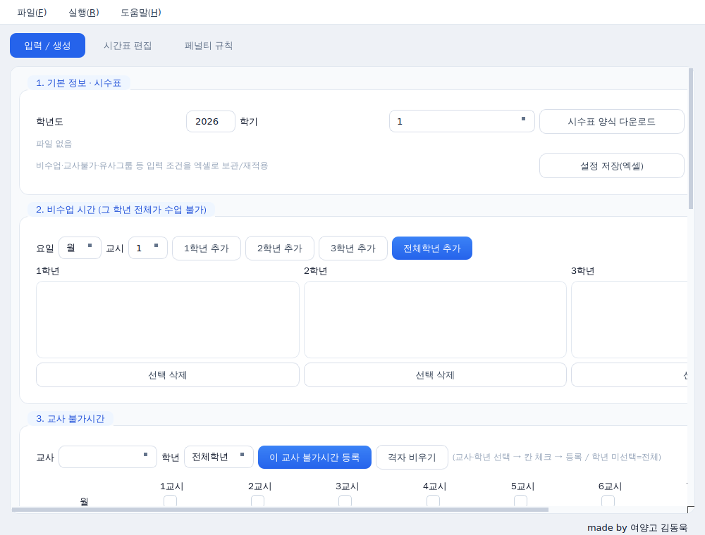

# 학교 시간표 생성기 (School Timetable Generator)

고등학교 주간 시간표를 **자동으로** 만들어 주는 데스크톱 프로그램입니다.
Google OR-Tools의 CP-SAT 솔버를 내장하여, 빈칸이 거의 없는 빡빡한 시수표도
규칙을 어기지 않고 풀어냅니다. 화면과 결과물은 모두 한글입니다.



## 주요 기능

- **시수표 한 장으로 자동 배치** — 엑셀 양식에 교사·과목·시수만 채우면 됩니다.
- **묶음수업(합반)·고정수업 지원** — 여러 학급이 같은 시간에 듣는 수업을 함께 배치합니다.
- **세밀한 조건 설정** — 비수업 시간, 교사 불가시간(요일×교시 격자), 유사과목 회피, 교사 연속수업 제한, 점심 전후 연속 방지.
- **실시간 진행상황 + 중단** — 점수가 줄어드는 과정을 보며 원할 때 멈출 수 있습니다.
- **이어 돌리기** — 만든 시간표를 저장했다가 나중에 그 지점부터 더 최적화합니다.
- **불가능 빠른 감지** — 조건이 모순이면 몇 초 안에 “해가 없다”고 알려주고, 어디를 고쳐야 하는지 안내합니다.
- **설정 저장/불러오기** — 입력 조건을 엑셀로 보관했다가 재적용합니다.

## 다운로드 (일반 사용자)

직접 빌드할 필요 없이 완성된 실행 파일을 받을 수 있습니다.

1. 이 저장소의 **[Releases](../../releases)** 페이지로 갑니다.
2. 최신 버전의 **`TimetableGenerator.exe`** 를 내려받습니다.
3. 더블클릭하면 바로 실행됩니다. (설치 불필요. 윈도우 64비트)

> 처음 실행 시 Windows SmartScreen 경고가 뜰 수 있습니다.
> “추가 정보” → “실행”을 누르면 됩니다. (서명되지 않은 개인 제작 프로그램이라 그렇습니다.)

## 사용법

1. **시수표 양식 다운로드** 버튼으로 빈 엑셀 양식을 받아 교사·과목·시수를 채웁니다.
2. **시수표 열기** 로 작성한 파일을 불러옵니다.
3. 필요하면 비수업 시간·교사 불가시간·유사과목 등을 설정합니다.
4. **시간표 생성** 을 누릅니다. 진행상황이 실시간으로 표시됩니다.
5. 완료되면 **엑셀로 저장** 으로 결과를 내려받습니다.

자세한 설명은 [`README.txt`](README.txt)에 들어 있습니다.

## 직접 빌드하기 (개발자)

### 방법 1 — 깃허브가 자동으로 빌드 (권장)

이 저장소는 GitHub Actions가 설정되어 있어, 버전 태그를 올리면 **윈도우용 EXE가 자동으로 빌드되어 Releases에 첨부**됩니다.

```bash
git tag v1.0.0
git push origin v1.0.0
```

태그를 올리지 않고 [Actions] 탭에서 **Run workflow** 를 눌러 수동 빌드할 수도 있습니다(결과물은 Artifacts로 내려받음).

### 방법 2 — 내 PC에서 직접 빌드

윈도우에서 Python 3.10 이상을 설치한 뒤(설치 시 “Add Python to PATH” 체크):

```bash
pip install -r requirements.txt pyinstaller
pyinstaller --onefile --windowed --name TimetableGenerator ^
  --collect-all ortools --collect-all openpyxl ^
  --add-data "template.xlsx;." gui_qt.py
```

또는 저장소에 포함된 **`build_exe.bat`** 을 더블클릭하면 위 과정을 자동으로 해줍니다.

## 소스로 바로 실행 (빌드 없이)

```bash
pip install -r requirements.txt
python gui_qt.py
```

## 프로젝트 구조

| 파일 | 설명 |
|------|------|
| `gui_qt.py` | 화면 (PySide6, 현재 사용) |
| `cpsat_solver.py` | CP-SAT 시간표 솔버 |
| `scheduler.py` | 페널티 계산·후처리 |
| `excel_parser.py` / `output.py` | 시수표 읽기 / 시간표 엑셀 저장 |
| `settings_io.py` / `session_io.py` | 설정 저장·불러오기 / 이어돌리기 |
| `models.py` | 데이터 구조 |
| `template.xlsx` | 빈 시수표 양식 |

## 라이선스

MIT License — 자유롭게 사용·수정·배포할 수 있습니다. [`LICENSE`](LICENSE) 참고.
내장 라이브러리: OR-Tools(Apache 2.0), PySide6/Qt(LGPL v3), openpyxl(MIT).

---
made by 여양고 김동욱
